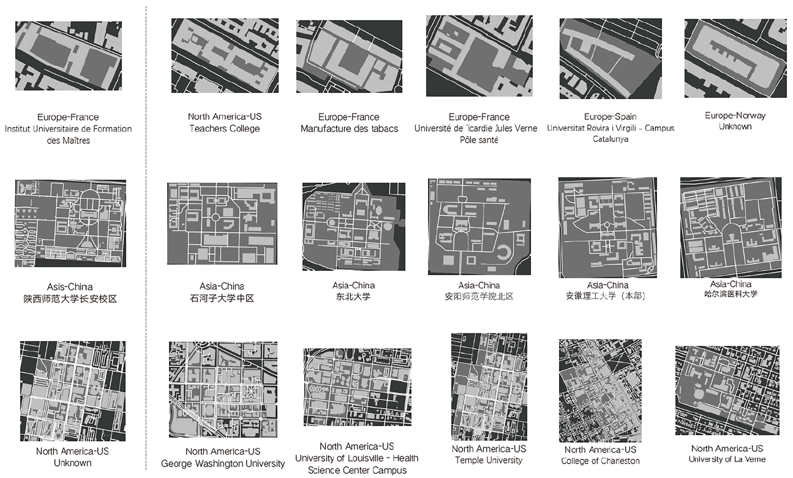

# campus-retrieval-clustering

A morphological retrival and clustering research of global university campuses.

This research is from the 2020 undergraduate project of [Inst. AAA](https://github.com/Inst-AAA).

### Related Papers
[张柏洲,李飚.基于大数据特征提取的建筑形态聚类检索方法研究——以大学校园为例](./files/PDF.pdf "PDF")
